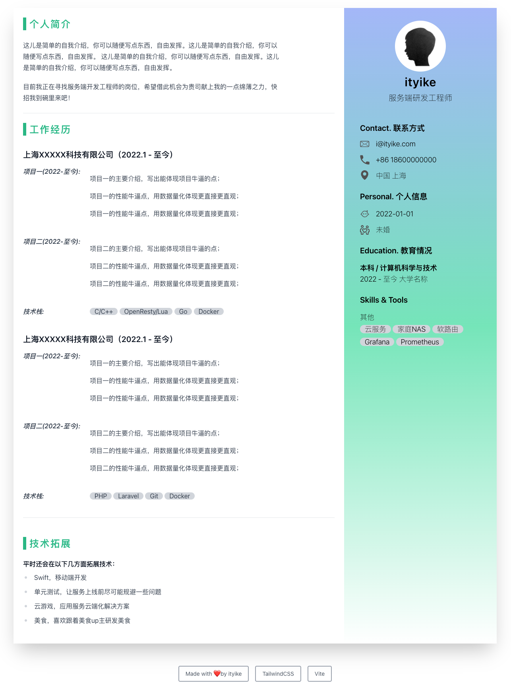

## Resume

这是一份很简洁的简历模板，不管是前端还是后端程序员都能写出自己的简历。
本模板基于`tailwindcss`和`vite`构建，只需要修改`index.html`文件中相关内容。

## 运行
```
git clone git@github.com:dyike/dev-resume.git
cd dev_resume
yarn
yarn run dev
// 浏览器查看，即可导出PDF文件
```

## 
祝大家都能找到心仪的工作❤️❤️❤️



